# Rapport de l’Activité Pratique n°1 – Utilisation de l’injection de dépendances avec Spring

---

## 🗂️ Organisation du projet

Voici la structure générale du projet tel qu’implémenté :
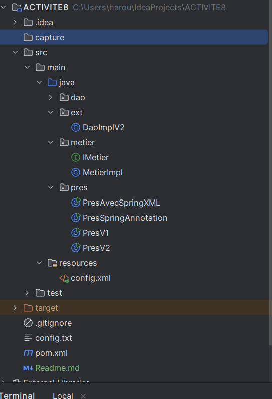

---

## 🔧 Définition des interfaces et implémentations

### Interface `IDao`
L’interface définit la méthode `getData()` qui sera utilisée par la couche métier :
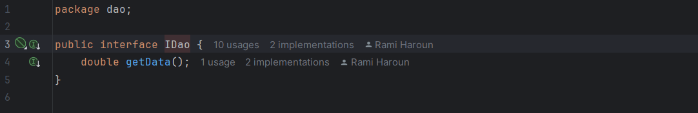

### Implémentation de `IDao`
Une version concrète de cette interface est fournie dans la classe `DaoImpl` :
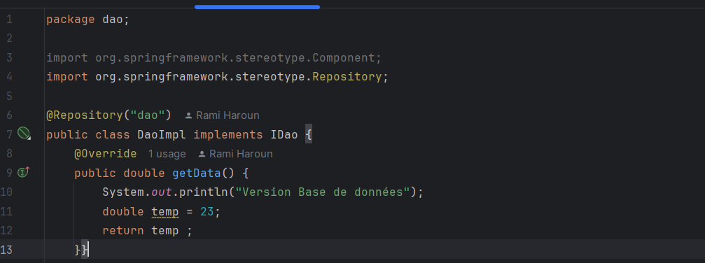

---

### Interface `IMetier`
Contient la méthode `calcul()` pour effectuer une opération à partir des données DAO :
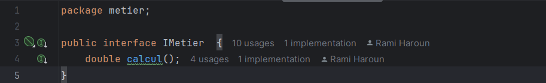

### Implémentation de `IMetier`
Ici, l’injection de dépendance est réalisée pour découpler les composants :
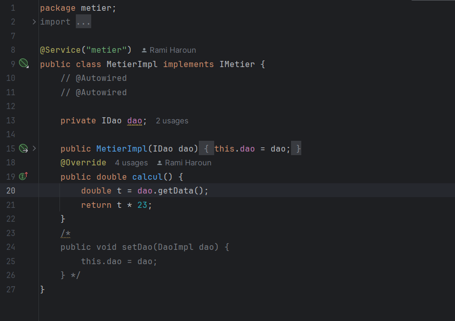

---

## ⚙️ Techniques d’injection de dépendances utilisées

### ➤ Instanciation manuelle (statique)
Cette méthode consiste à créer les objets manuellement dans le code :
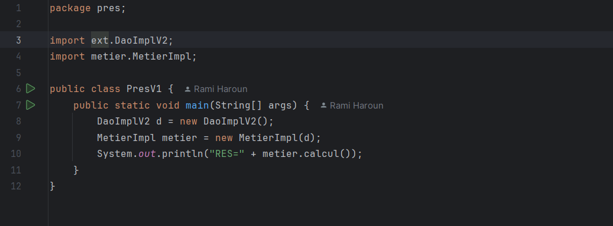

### ➤ Instanciation dynamique
Utilisation d’une approche plus souple avec des paramètres :
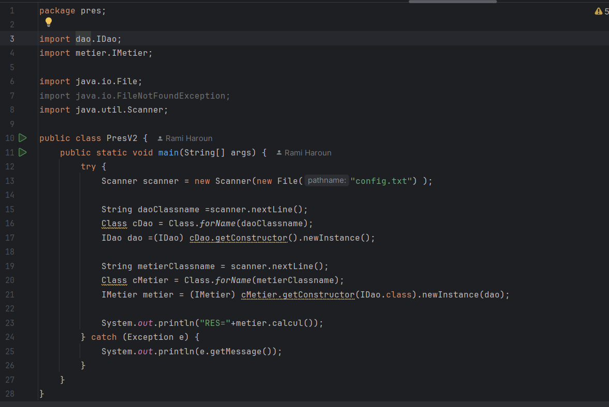

---

## 📁 Configuration et exécutions

### Configurations – Base de données
Fichier de configuration utilisé pour la version "base de données" :
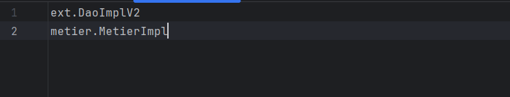

### Résultat – Base de données
Voici ce que le programme affiche avec cette configuration :
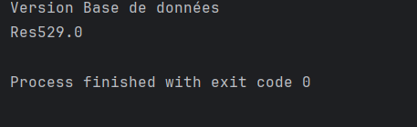

### Configurations – Web service
Un second fichier est utilisé pour la version "web service" :
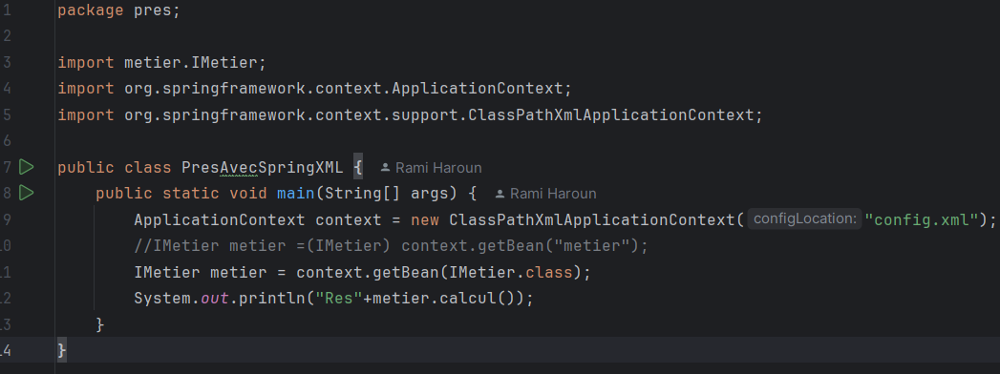

### Résultat – Web service
Affichage de la console avec ce paramétrage :
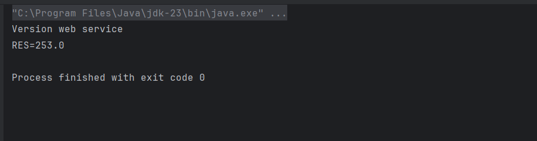

---

## 🌿 Mise en œuvre avec le framework Spring

### 🔸 Configuration avec fichier XML
Injection gérée via un fichier `config;xml` :

### 🔸 Configuration avec annotations
Utilisation des annotations Spring pour automatiser l’injection :
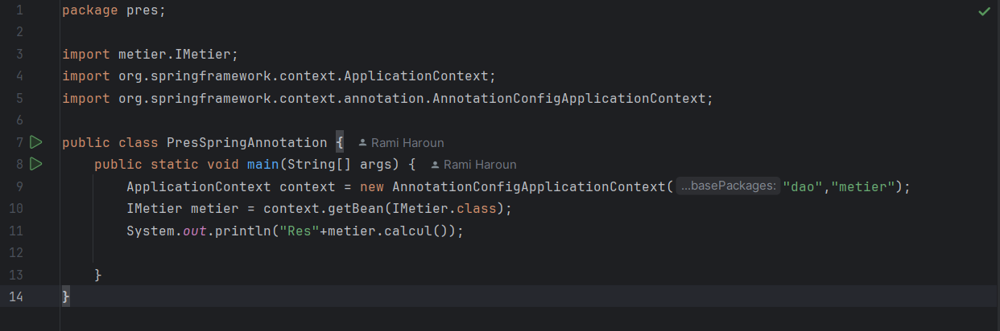

---

## 📄 Fichiers de configuration supplémentaires

### Fichier `config.xml`
Déclaration des beans et liens entre composants :
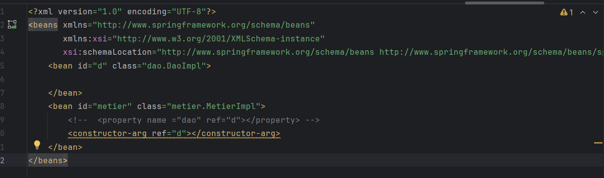

### Fichier `pom.xml`
Liste des dépendances Maven utilisées dans le projet :
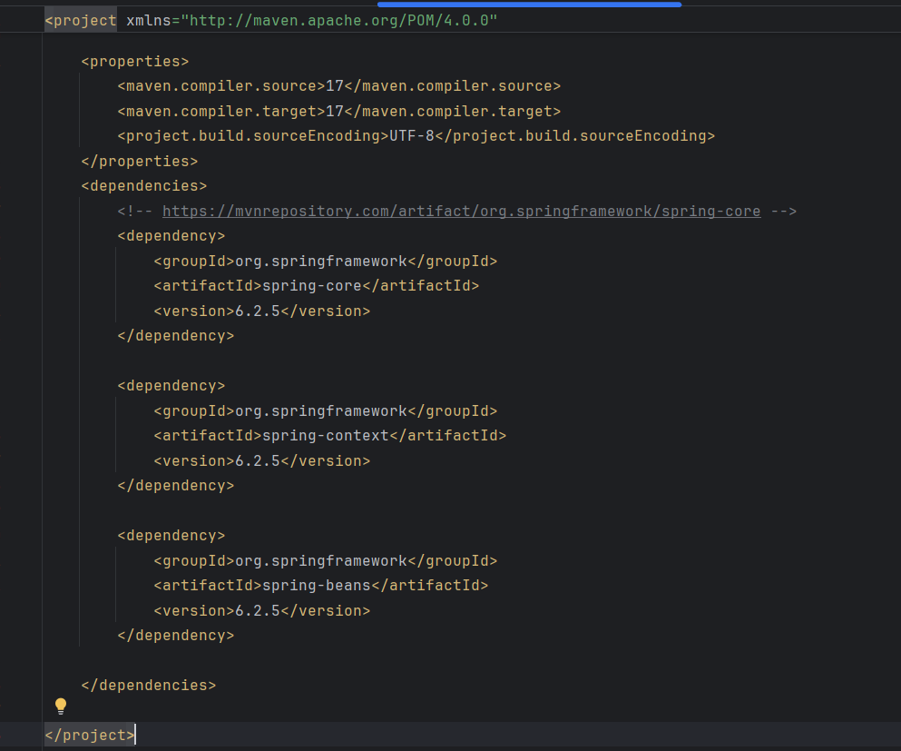

---
